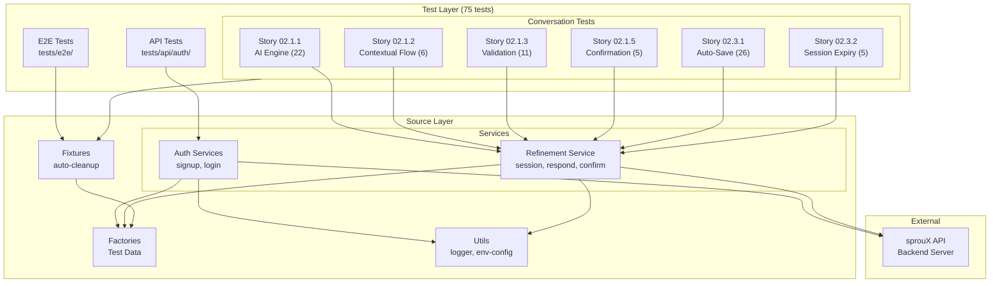
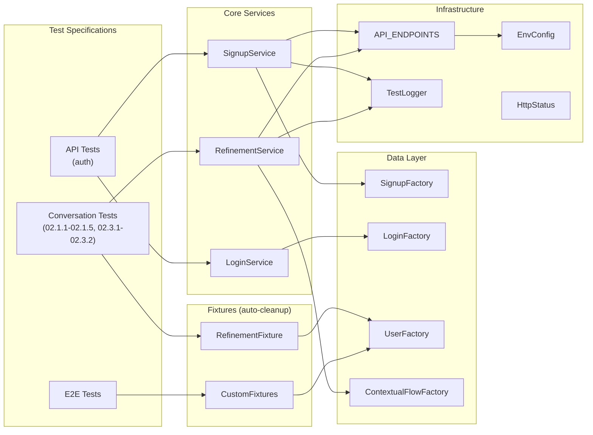
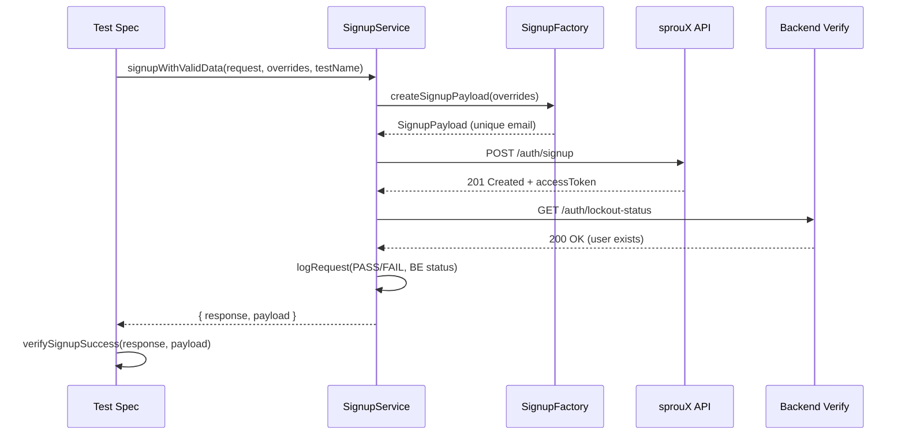
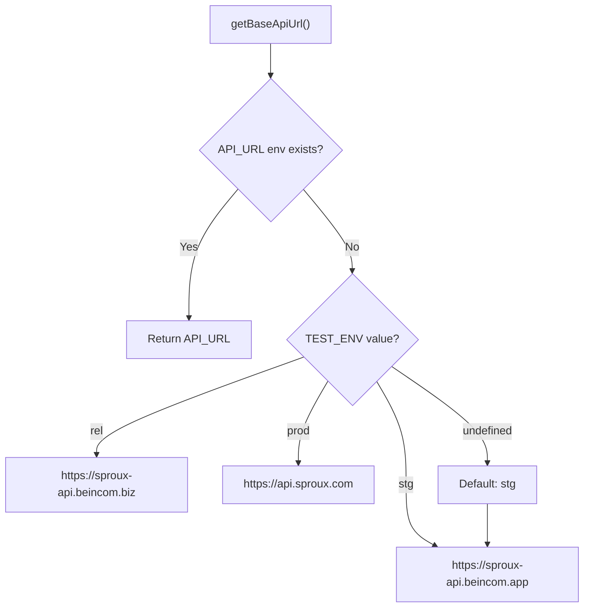
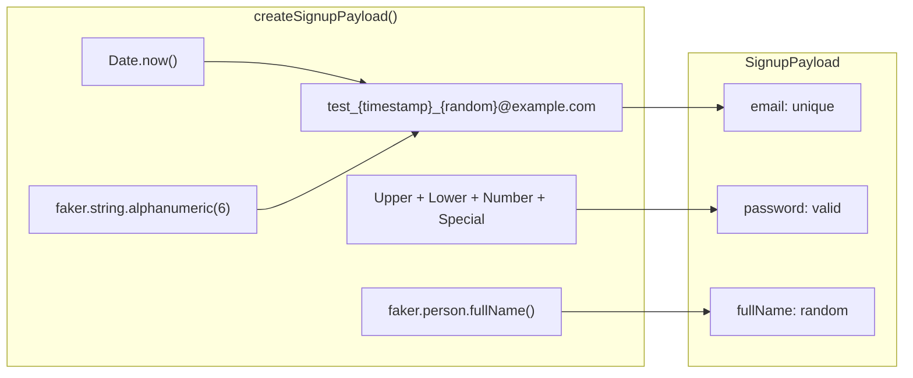
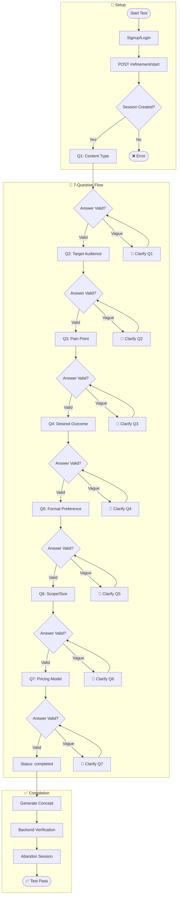
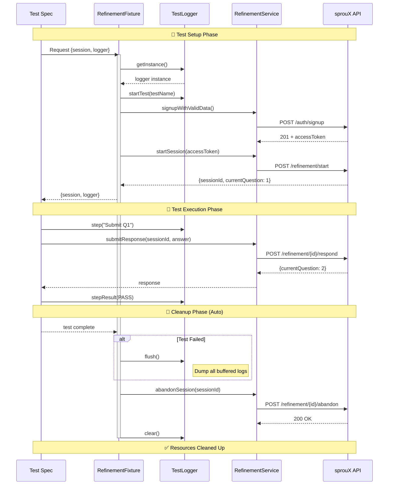
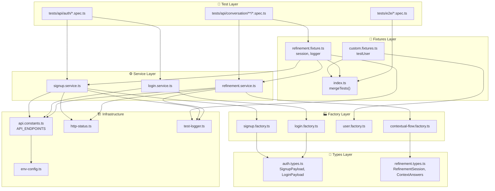

# Architecture Document: sprouX-testing

## Tổng Quan

**sprouX-testing** là một framework kiểm thử tự động sử dụng Playwright, được thiết kế theo kiến trúc modular với các pattern rõ ràng để đảm bảo tính mở rộng, bảo trì và parallel-safe.



---

## 1. Tech Stack

### Core Framework

| Component      | Technology      | Version    | Mục đích                               |
| -------------- | --------------- | ---------- | -------------------------------------- |
| Test Framework | Playwright      | ^1.48.0    | API & E2E test automation              |
| Language       | TypeScript      | ^5.3.3     | Type-safe code với strict mode         |
| Runtime        | Node.js         | >= 20.11.0 | LTS runtime                            |
| Test Data      | @faker-js/faker | ^8.4.1     | Random data generation (parallel-safe) |
| Environment    | dotenv          | ^16.4.5    | Environment variable management        |

### TypeScript Configuration

```typescript
{
    "target": "ES2022",
    "module": "ESNext",
    "strict": true,              // CRITICAL: All code must be type-safe
    "paths": {
        "@src/*": ["src/*"]      // Path alias for clean imports
    }
}
```

### Playwright Configuration (Updated 2026-01-03)

| Setting            | Value     | Mô tả                                |
| ------------------ | --------- | ------------------------------------ |
| Test timeout       | **120s**  | Tăng từ 60s cho Q1→Q7 flow tests     |
| Action timeout     | 15s       | Maximum time per action              |
| Navigation timeout | 30s       | Maximum time for page navigation     |
| Assertion timeout  | 15s       | Maximum time for expect()            |
| Workers            | **1**     | Single worker để tránh rate limiting |
| fullyParallel      | **false** | Disabled cho API stability           |
| Retries (CI)       | 2         | Auto-retry failed tests on CI        |

**⚠️ CRITICAL:** Những giá trị này đã được production-tuned. KHÔNG thay đổi mà không có team approval.

---

## 2. System Components

### 2.1 Component Diagram



### 2.2 Component Details

#### Services (`src/{module}/{feature}.service.ts`)

Encapsulate tất cả API operations với logging và verification.

| Service           | File                     | Responsibility                                  |
| ----------------- | ------------------------ | ----------------------------------------------- |
| SignupService     | `auth/signup.service.ts` | Signup API operations, backend verification     |
| LoginService      | `auth/login.service.ts`  | Login API operations, authentication            |
| RefinementService | `refinement.service.ts`  | Contextual Q&A flow (7 questions), session mgmt |

**Key Features:**

- Request/response logging với PASS/FAIL status
- Backend verification sau successful operations
- Centralized error handling
- `testName` parameter cho traceability

```typescript
// Service signature example
export async function signupWithValidData(
    request: APIRequestContext,
    overrides?: Partial<SignupPayload>,
    testName?: string
): Promise<{ response: APIResponse; payload: SignupPayload }>;
```

#### Factories (`src/{module}/{feature}.factory.ts`)

Generate test data với faker.js, đảm bảo parallel-safe.

| Factory               | File                                   | Output                             |
| --------------------- | -------------------------------------- | ---------------------------------- |
| SignupFactory         | `auth/signup.factory.ts`               | `SignupPayload` với unique email   |
| LoginFactory          | `auth/login.factory.ts`                | `LoginPayload` cho authentication  |
| UserFactory           | `factories/user.factory.ts`            | `User` object cho fixtures         |
| ContextualFlowFactory | `factories/contextual-flow.factory.ts` | Q1-Q7 answers cho refinement tests |

**Key Features:**

- Timestamp + random string cho unique IDs
- Password generation tuân thủ validation rules (8-15 chars, upper, lower, number, special)
- Override support cho custom test data

```typescript
// Factory example
export function createSignupPayload(overrides: Partial<SignupPayload> = {}): SignupPayload {
    return {
        email: `test_${Date.now()}_${random}@example.com`,
        password: generateValidPassword(),
        fullName: faker.person.fullName(),
        ...overrides,
    };
}
```

#### Fixtures (`src/fixtures/`)

Custom Playwright fixtures extend base test functionality với **auto-cleanup**.

| Fixture           | File                    | Provides                             |
| ----------------- | ----------------------- | ------------------------------------ |
| CustomFixtures    | `custom.fixtures.ts`    | `testUser` - pre-created user data   |
| RefinementFixture | `refinement.fixture.ts` | `session`, `logger` với auto-cleanup |
| MergedFixtures    | `index.ts`              | Combined fixtures via `mergeTests()` |

```typescript
// Custom fixture với auto-cleanup
export const test = base.extend<RefinementFixtures>({
    session: async ({ request }, use) => {
        // Setup: Create session
        const session = await RefinementService.startSession(request);
        await use(session);
        // Cleanup: Auto-abandon session after test
        await RefinementService.abandonSession(request, session.id);
    },
});
```

**✅ ALWAYS use auto-cleanup fixtures for resources (sessions, users, etc.)**

#### Constants (`src/constants/`)

| File               | Purpose                    |
| ------------------ | -------------------------- |
| `api.constants.ts` | Centralized API endpoints  |
| `http-status.ts`   | HTTP status code constants |

```typescript
export const API_ENDPOINTS = {
    AUTH: {
        SIGNUP, LOGIN, LOGOUT, REFRESH_TOKEN,
        FORGOT_PASSWORD, RESET_PASSWORD, VERIFY_EMAIL,
        LOCKOUT_STATUS, DEVICES
    },
    REFINEMENT: {
        START,                                    // POST - Start session
        RESPOND: (sessionId) => ...,              // POST - Submit response
        GET_SESSION: (sessionId) => ...,          // GET - Get session
        HISTORY: (sessionId) => ...,              // GET - Get history
        SKIP: (sessionId) => ...,                 // POST - Skip question
        EDIT_QUESTION: (sessionId, qNum) => ...,  // PUT - Edit answer
        CONFIRM_IMPACT: (sessionId, qNum) => ..., // POST - Confirm impact
        RESUME: (sessionId) => ...,               // POST - Resume session
        UPDATE_CONCEPT: (sessionId) => ...,       // PUT - Update concept
        ABANDON: (sessionId) => ...,              // POST - Abandon session
        DELETE: (sessionId) => ...,               // DELETE - Delete session
        CONFIRM: (sessionId) => ...,              // POST - Confirm concept
        STREAM: (sessionId) => ...,               // GET - SSE stream
        REGENERATE_CONCEPT: (sessionId) => ...,   // POST - Regenerate
        ANALYTICS: { ABANDONMENT, VAGUENESS, HEALTH }
    }
} as const;
```

#### Config (`src/utils/`, `src/config/`)

| File            | Purpose                         |
| --------------- | ------------------------------- |
| `env-config.ts` | Environment variable management |
| `api.config.ts` | API configuration               |

---

## 3. Data Flow

### 3.1 API Test Flow



### 3.2 Environment Resolution Flow



### 3.3 Test Data Generation Flow



### 3.4 Refinement Flow (Q1→Q7 Contextual Questions)



### 3.5 Test Execution Flow (Fixture Lifecycle)



### 3.6 Module Dependencies



---

## 4. Directory Structure

```
sprouX-testing/
├── src/                              # Source utilities
│   ├── auth/                         # Authentication module
│   │   ├── auth.types.ts             # Type definitions
│   │   ├── login/                    # Login feature
│   │   │   ├── login.factory.ts
│   │   │   └── login.service.ts
│   │   └── signup/                   # Signup feature
│   │       ├── signup.factory.ts
│   │       └── signup.service.ts
│   ├── refinement/                   # Refinement module (Stories 02.1.1-02.1.5)
│   │   ├── refinement.service.ts     # API operations
│   │   ├── refinement.types.ts       # Type definitions
│   │   ├── test-data.ts              # Test data constants
│   │   └── index.ts                  # Module exports
│   ├── config/                       # Configuration
│   │   └── api.config.ts
│   ├── constants/                    # Constants
│   │   ├── api.constants.ts          # Centralized API endpoints
│   │   └── http-status.ts
│   ├── factories/                    # Generic data factories
│   │   ├── user.factory.ts
│   │   ├── contextual-flow.factory.ts
│   │   └── index.ts
│   ├── fixtures/                     # Playwright fixtures
│   │   ├── custom.fixtures.ts        # Base fixtures
│   │   ├── refinement.fixture.ts     # Auto-cleanup fixtures
│   │   └── index.ts                  # Merged exports
│   ├── utils/                        # Utilities
│   │   ├── env-config.ts             # Environment configuration
│   │   └── test-logger.ts            # Buffered test logging
│   └── index.ts                      # Central exports
├── tests/                            # Test specifications
│   ├── api/                          # API tests (no browser)
│   │   ├── auth/                     # Auth API tests
│   │   │   ├── P0-login.spec.ts
│   │   │   ├── P1-login.spec.ts
│   │   │   ├── P2-login.spec.ts
│   │   │   └── signup-with-3-fields.spec.ts
│   │   └── conversation/             # Conversation API tests
│   │       └── phase1/
│   │           ├── story-02.1.1-ai-conversation-engine/   # 22 tests
│   │           │   ├── P0-conversation-flow.spec.ts
│   │           │   ├── P0-validation.spec.ts
│   │           │   ├── P0-security.spec.ts
│   │           │   ├── P0-atomic-save.spec.ts
│   │           │   ├── P0-clarification-flow.spec.ts
│   │           │   ├── P0-history-access.spec.ts
│   │           │   ├── P0-skip-validation.spec.ts
│   │           │   ├── P0-session-resume.spec.ts
│   │           │   ├── P1-*.spec.ts (5 files)
│   │           │   ├── P2-*.spec.ts (6 files)
│   │           │   └── P3-performance.spec.ts
│   │           ├── story-02.1.2-contextual-question-flow/ # 4 tests
│   │           │   ├── P0-context-extraction.spec.ts
│   │           │   ├── P0-context-persistence.spec.ts
│   │           │   └── P{0,1,2}-edge-cases.spec.ts
│   │           ├── story-02.1.3-ai-response-validation/   # 11 tests
│   │           │   ├── P0-validation-empty-short.spec.ts
│   │           │   ├── P0-clarification-flow.spec.ts
│   │           │   ├── P0-concurrent-requests.spec.ts
│   │           │   ├── P0-session-state-tracking.spec.ts
│   │           │   └── P{1,2}-*.spec.ts
│   │           ├── story-02.1.5-output-confirmation-step/ # 5 tests
│   │           │   ├── P0-concept-generation.spec.ts
│   │           │   ├── P0-concept-validation.spec.ts
│   │           │   ├── P0-confirm-concept.spec.ts
│   │           │   ├── P1-auto-generated-fields.spec.ts
│   │           │   └── P2-edge-cases.spec.ts
│   │           ├── story-02.3.1-auto-save-engine/        # 26 tests
│   │           │   ├── P0-auto-save.spec.ts
│   │           │   ├── P0-idempotency.spec.ts
│   │           │   ├── P0-concurrent-write.spec.ts
│   │           │   ├── P0-session-validation.spec.ts
│   │           │   ├── P0-network-failure.spec.ts
│   │           │   ├── P0-performance.spec.ts
│   │           │   └── README.md
│   │           └── story-02.3.2-session-expiry-logic/    # 5 tests
│   │               ├── P0-expiry-detection.spec.ts
│   │               ├── P0-session-resume.spec.ts
│   │               ├── P0-start-fresh.spec.ts
│   │               ├── P0-hard-delete.spec.ts
│   │               ├── P0-performance.spec.ts
│   │               └── README.md
│   └── e2e/                          # E2E tests (browser-based)
│       └── example.spec.ts
├── docs/                             # Documentation
├── playwright.config.ts              # Playwright configuration
├── tsconfig.json                     # TypeScript configuration
├── eslint.config.mjs                 # ESLint flat config
├── .prettierrc                       # Prettier configuration
├── package.json                      # Dependencies
└── .env                              # Environment variables (not committed)
```

### Story-Based Test Organization

**Pattern:** `tests/api/{domain}/phase{N}/story-{epic}.{story}-{name}/P{priority}-{feature}.spec.ts`

**Stories hiện có:**

| Story  | Folder Name                             | Test Count | Description                                  |
| ------ | --------------------------------------- | ---------- | -------------------------------------------- |
| 02.1.1 | `story-02.1.1-ai-conversation-engine`   | 22         | Core Q1→Q7 flow, session, pricing            |
| 02.1.2 | `story-02.1.2-contextual-question-flow` | 6          | Context extraction & persistence             |
| 02.1.3 | `story-02.1.3-ai-response-validation`   | 11         | Input validation, concurrency                |
| 02.1.5 | `story-02.1.5-output-confirmation-step` | 5          | Concept generation & confirm                 |
| 02.3.1 | `story-02.3.1-auto-save-engine`         | 26         | Auto-save, idempotency, conflict detection   |
| 02.3.2 | `story-02.3.2-session-expiry-logic`     | 5          | 24h expiry, resume, start fresh, hard delete |

| Priority | Meaning                  | Run Frequency |
| -------- | ------------------------ | ------------- |
| `P0`     | Critical path, must pass | Every commit  |
| `P1`     | Important, should pass   | Every PR      |
| `P2`     | Nice to have, can defer  | Nightly       |
| `P3`     | Performance/benchmark    | Weekly        |

---

## 5. Design Patterns

### 5.1 Service Pattern

**Mục đích:** Encapsulate API operations, không gọi API trực tiếp trong tests.

```typescript
// WRONG - Direct API call in test
await request.post('/auth/signup', { data: payload });

// CORRECT - Use service
const { response, payload } = await SignupService.signupWithValidData(request, undefined, testName);
```

### 5.2 Factory Pattern

**Mục đích:** Generate unique test data, đảm bảo parallel-safe.

```typescript
// WRONG - Hardcoded data
const payload = { email: 'test@test.com', password: 'Test@123' };

// CORRECT - Use factory
const payload = createSignupPayload({ fullName: 'Custom Name' });
```

### 5.3 Centralized Constants Pattern

**Mục đích:** Single source of truth cho URLs và endpoints.

```typescript
// WRONG - Hardcoded URL
await request.post('https://sproux-api.beincom.app/auth/signup');

// CORRECT - Use constants
await request.post(API_ENDPOINTS.AUTH.SIGNUP, { data: payload });
```

### 5.4 Fixture Pattern

**Mục đích:** Extend Playwright với custom test context và auto-cleanup.

```typescript
// Merged fixtures từ nhiều sources
import { mergeTests } from '@playwright/test';
export const test = mergeTests(customFixtures, refinementFixtures);

// Auto-cleanup fixture
export const test = base.extend<RefinementFixtures>({
    session: async ({ request }, use) => {
        const session = await startSession(request);
        await use(session);
        await abandonSession(session.id); // Auto-cleanup
    },
});
```

### 5.5 Test Logger Pattern

**Mục đích:** Buffered logging với mode-aware output.

```typescript
import { TestLogger } from '@src/utils/test-logger';
const logger = TestLogger.getInstance();

// Buffered logging (only shown on failure)
logger.step('Submit Q1');
logger.info('Processing...');

// Always shown
logger.summary({ status: 'PASS', expected: 200, actual: 200 });

// Dump all on failure
logger.flush();
```

**LOG_MODE environment variable:**

| Mode    | Output              | Use case    |
| ------- | ------------------- | ----------- |
| `local` | Full detailed steps | Development |
| `prod`  | Minimal, API calls  | CI/CD       |

---

## 6. Test Projects

| Project    | Directory    | Browser | Use Case              |
| ---------- | ------------ | ------- | --------------------- |
| `api`      | `tests/api/` | None    | API testing (fastest) |
| `chromium` | `tests/e2e/` | Chrome  | E2E on Chrome         |
| `firefox`  | `tests/e2e/` | Firefox | E2E on Firefox        |
| `webkit`   | `tests/e2e/` | Safari  | E2E on Safari         |

### Running Tests

```bash
# API tests only
npm run test:api

# E2E tests only
npm run test:e2e

# By priority
npx playwright test --project=api --grep "P0"

# With UI
npm run test:ui

# Debug mode
npm run test:debug
```

---

## 7. Environment Configuration

### Supported Environments

| Environment       | Variable        | URL                            |
| ----------------- | --------------- | ------------------------------ |
| Staging (default) | `TEST_ENV=stg`  | https://sproux-api.beincom.app |
| Release           | `TEST_ENV=rel`  | https://sproux-api.beincom.biz |
| Production        | `TEST_ENV=prod` | https://api.sproux.com         |

### Environment Variables

```env
# .env file
TEST_ENV=stg                              # Environment: stg, rel, prod
API_URL=https://sproux-api.beincom.app    # Optional: Override URL
API_TIMEOUT=30000                         # API timeout in ms
```

---

## 8. Logging Format

Services output structured logs cho traceability:

```
🧪 [P0] Create account with valid data
   [POST] https://sproux-api.beincom.app/auth/signup
   📋 {"email":"test_1703123456_abc123@example.com","password":"ABcde12!","fullName":"John Doe"}
   📥 Expected: 201 | Actual: 201 → ✅ PASS → BE ✅
```

| Icon    | Meaning                     |
| ------- | --------------------------- |
| ✅ PASS | Status matches expected     |
| ❌ FAIL | Status does not match       |
| BE ✅   | Backend verification passed |
| BE ❌   | Backend verification failed |

---

## 9. Type Definitions

### SignupPayload

```typescript
interface SignupPayload {
    email: string;
    password: string;
    fullName: string;
}
```

### SignupResponse

```typescript
interface SignupResponse {
    expiresAt: number;
    user: {
        id: string;
        email: string;
        roles: string[];
        emailVerified: boolean;
    };
    accessToken?: string;
    refreshToken?: string;
}
```

### LoginPayload

```typescript
interface LoginPayload {
    email: string;
    password: string;
}
```

### AuthUser

```typescript
interface AuthUser {
    id: string;
    email: string;
    roles: string[];
    emailVerified: boolean;
}
```

### RefinementSession (Stories 02.1.1 - 02.1.5)

```typescript
type SessionStatus =
    | 'active' // Session started
    | 'questioning' // Asking questions
    | 'clarifying' // Clarifying vague answer
    | 'clarifying_edit' // Clarifying edited answer
    | 'analyzing_impact' // Analyzing edit impact
    | 'completed' // All Q answered
    | 'pending_ai_response' // Waiting for AI
    | 'failed'; // Error state

interface RefinementSession {
    sessionId: string;
    currentQuestion: number; // 1-7
    answeredQuestions: number;
    status: SessionStatus;
    skippedQuestions?: number[];
    concept?: ConceptData;
    messages?: Message[];
}

interface StartSessionResponse {
    sessionId: string;
    currentQuestion: number;
    status: SessionStatus;
    messages?: Message[];
}

interface ConceptData {
    title: string;
    description: string;
    qualityScore: number;
    pricing?: {
        regular: number;
        earlyBird: number;
    };
}
```

### ContextAnswers (Q1-Q7)

```typescript
interface ContextAnswers {
    q1_content: string; // What content?
    q2_audience: string; // Target audience?
    q3_painPoint: string; // Pain point?
    q4_outcome: string; // Desired outcome?
    q5_format: string; // Format preference?
    q6_scope: string; // Scope/size?
    q7_pricing: string; // Pricing model?
}
```

---

## 10. Test Categories

### Summary by Priority

| Priority  | Description                             | Test Count   |
| --------- | --------------------------------------- | ------------ |
| P0        | Critical path - must pass               | 54 tests     |
| P1        | High priority - validation & edge cases | 12 tests     |
| P2        | Standard - nice to have                 | 6 tests      |
| P3        | Performance/benchmark                   | 3 tests      |
| **Total** | **All conversation tests**              | **75 tests** |

### Auth Tests (4 files)

- `signup-with-3-fields.spec.ts` - Signup với 3 fields
- `P0-login.spec.ts` - Login critical path
- `P1-login.spec.ts` - Login validation
- `P2-login.spec.ts` - Login edge cases

### Conversation Tests by Story

#### Story 02.1.1 - AI Conversation Engine (22 files)

| Priority | Files   | Coverage                                                                                   |
| -------- | ------- | ------------------------------------------------------------------------------------------ |
| P0       | 8 files | Core flow, validation, security, atomic-save, clarification, history, skip, resume         |
| P1       | 5 files | Skip flow, edit flow, session mgmt, pricing validation/logic                               |
| P2       | 6 files | Message types, SSE streaming, analytics, session ops, error handling, re-contextualization |
| P3       | 1 file  | Performance benchmarks                                                                     |

#### Story 02.1.2 - Contextual Question Flow (4 files)

- `P0-context-extraction.spec.ts` - Context extraction from answers
- `P0-context-persistence.spec.ts` - Data persistence across questions
- `P{0,1,2}-edge-cases.spec.ts` - Edge cases by priority

#### Story 02.1.3 - AI Response Validation (11 files)

- `P0-validation-empty-short.spec.ts` - Empty/short input validation
- `P0-clarification-flow.spec.ts` - Vague answer handling
- `P0-concurrent-requests.spec.ts` - Concurrent request handling
- `P0-session-state-tracking.spec.ts` - Session state consistency
- `P1-*.spec.ts` - Probe format, session state, vagueness, validation format
- `P2-*.spec.ts` - Session history, performance, edge cases

#### Story 02.1.5 - Output Confirmation Step (5 files)

- `P0-concept-generation.spec.ts` - Concept generation after Q7
- `P0-concept-validation.spec.ts` - Concept data validation
- `P0-confirm-concept.spec.ts` - Concept confirmation flow
- `P1-auto-generated-fields.spec.ts` - Auto-generated fields validation
- `P2-edge-cases.spec.ts` - Edge cases

#### Story 02.3.1 - Auto-Save Engine (6 files, 26 tests)

- `P0-auto-save.spec.ts` - Core auto-save flow, concept not found
- `P0-idempotency.spec.ts` - Duplicate prevention with client_msg_id
- `P0-concurrent-write.spec.ts` - Optimistic locking, version conflict
- `P0-session-validation.spec.ts` - Session expired, unauthorized access
- `P0-network-failure.spec.ts` - Network failure, database timeout
- `P0-performance.spec.ts` - p95 latency benchmark

#### Story 02.3.2 - Session Expiry Logic (5 files)

- `P0-expiry-detection.spec.ts` - 24h inactivity detection, token invalidation
- `P0-session-resume.spec.ts` - Resume blocked for expired sessions
- `P0-start-fresh.spec.ts` - New session creation, old session archive
- `P0-hard-delete.spec.ts` - 30-day cleanup, audit logs
- `P0-performance.spec.ts` - 10K sessions trong <5s

---

## 11. Critical Rules

### DO

- Use `@src/*` path alias for imports
- Use Service functions for API calls
- Use Factory functions for test data
- Use `API_ENDPOINTS` for all URLs
- Include `testName` in service calls
- Generate unique emails with timestamp + random

### DO NOT

- Hardcode API URLs
- Call API directly in tests
- Hardcode test data (use factories)
- Use static emails (collision risk)
- Use `any` type (strict mode enabled)
- Change timeout values without team discussion
- Create shared state between tests

---

## 12. Adding New Features

### Adding New API Endpoint

1. Add endpoint to `src/constants/api.constants.ts`
2. Create types in `src/auth/auth.types.ts` (or new module)
3. Create factory in `src/auth/{feature}/{feature}.factory.ts`
4. Create service in `src/auth/{feature}/{feature}.service.ts`
5. Create tests in `tests/api/auth/{feature}.spec.ts`

### Adding New E2E Test

1. Create test file in `tests/e2e/{feature}.spec.ts`
2. Use custom fixtures from `src/fixtures`
3. Follow existing naming conventions

---

**Last Updated:** 2026-01-05
**Version:** 3.2.0
**Framework Version:** Playwright 1.48.0
**Author:** Paige (Technical Writer - BMAD)
**Related:** See `_bmad-output/project-context.md` for AI agent rules
**Test Count:** 75 conversation tests + 4 auth tests
