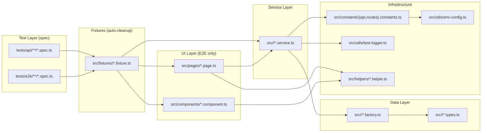
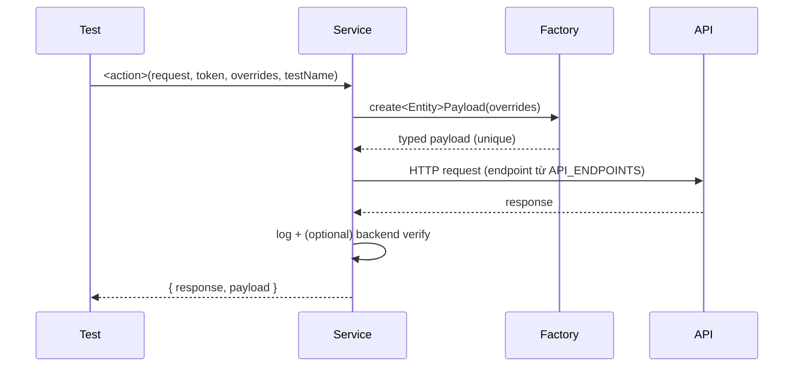
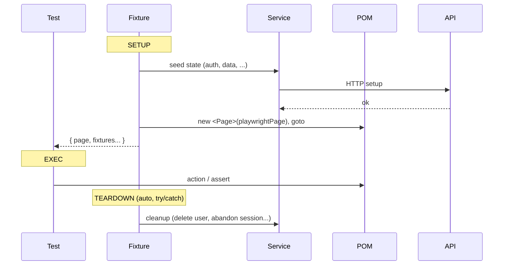
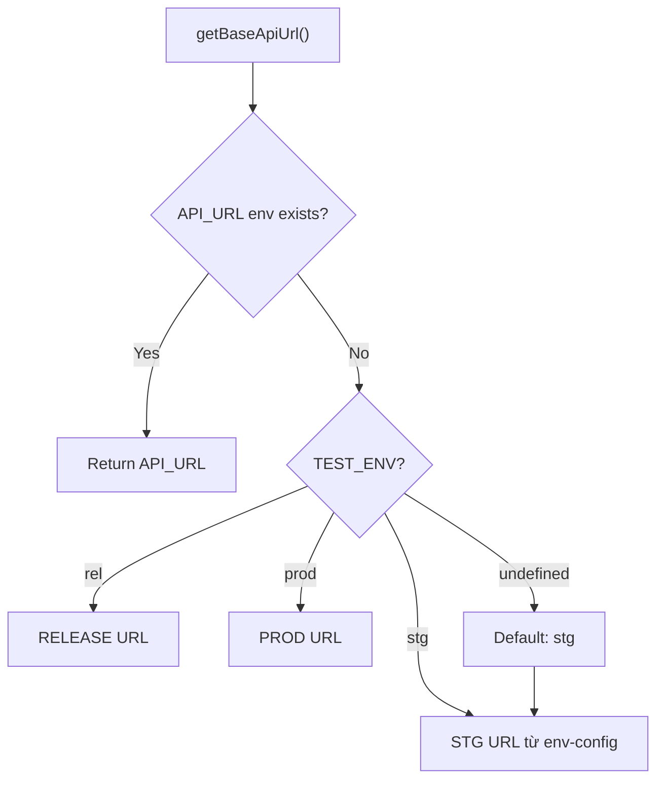

# Architecture — Playwright + TypeScript QA Harness

Generic kiến trúc cho mọi Playwright + TS consumer. Mọi giá trị cụ thể (URL, env name, story count) consumer tự điền.

## 1. Tech stack

| Component       | Recommended           | Vai trò                                  |
| --------------- | --------------------- | ---------------------------------------- |
| Test framework  | Playwright ≥ 1.48     | API + E2E automation                     |
| Language        | TypeScript ≥ 5.3      | Strict mode bắt buộc                     |
| Runtime         | Node.js ≥ 20 LTS      |                                          |
| Test data       | @faker-js/faker       | Unique payload (parallel-safe)           |
| Env management  | dotenv                | `.env` per environment                   |
| Lint            | ESLint flat config    | Enforce layer deps                       |
| Format          | Prettier              |                                          |
| Pre-commit      | Husky + lint-staged   | Block bad commits                        |

## 2. TypeScript config (mandatory)

```jsonc
{
  "compilerOptions": {
    "target": "ES2022",
    "module": "ESNext",
    "strict": true,                // BẮT BUỘC — chống `any`/`unknown`
    "noImplicitAny": true,
    "paths": { "@src/*": ["src/*"] }   // path alias — KHÔNG relative
  }
}
```

## 3. Playwright config — production-tuned guidance

| Setting              | Default      | Lý do                                                  |
| -------------------- | ------------ | ------------------------------------------------------ |
| `testTimeout`        | 60–120s      | Tăng nếu có AI/SSE/long-poll flow                      |
| `actionTimeout`      | 15s          | Max thời gian/action (click, fill)                     |
| `navigationTimeout`  | 30s          | Max thời gian/page.goto                                |
| `expect.timeout`     | 15s          | Max thời gian/`expect().toX()`                         |
| `workers`            | 1–4          | 1 nếu BE rate-limit, scale lên khi parallel-safe       |
| `fullyParallel`      | false → true | Bật khi đã verify fixture không share state            |
| `retries` (CI)       | 1–2          | Auto-retry flaky tests trên CI                         |
| `reporter`           | html + list  | + custom JSON nếu cần langfuse/dashboard               |

⚠️ Mọi giá trị trên đã được production-tuned ở consumer typical. Đổi → ghi rõ lý do trong PR.

## 4. Component diagram (generic)



## 5. Layer dependency (one-way, ESLint enforced)

```
tests/ → fixtures/ → pages/ + components/ → services/ + helpers/ → factory/ + constants/ + types/
```

- `components/` KHÔNG import `pages/`
- `services/` KHÔNG import `pages/` hoặc `components/`
- `helpers/` chỉ import `constants/` + `types/`
- Mọi import từ `src/` PHẢI dùng `@src/*` alias

| Layer            | Vai trò                                                | API | E2E |
| ---------------- | ------------------------------------------------------ | --- | --- |
| `types/`         | Interface shape data + DTO                             | ✅  | ✅  |
| `constants/`     | `API_ENDPOINTS` + `ROUTES` + selector tokens           | ✅  | ✅  |
| `factory/`       | Faker-based unique payload (parallel-safe)             | ✅  | ✅  |
| `service/`       | API wrapper + logging + response verification          | ✅  | ✅  |
| `pages/` (POM)   | 1 class per page — locators + page-level actions       | ❌  | ✅  |
| `components/` (COM) | Reusable UI component (header, modal, form, table)  | ❌  | ✅  |
| `helpers/`       | Pure utility (waits, formatters, assertions, network)  | ✅  | ✅  |
| `fixtures/`      | Auto setup/cleanup (composable: API state + UI state)  | ✅  | ✅  |

## 6. Data flow — API test



## 7. Data flow — E2E test (fixture lifecycle)



## 8. Environment resolution



```env
# .env (consumer)
TEST_ENV=stg              # stg | rel | prod (consumer-defined)
API_URL=                  # optional — override
API_TIMEOUT=30000
LOG_MODE=local            # local | prod
```

| Mode    | Output                | Use case      |
| ------- | --------------------- | ------------- |
| `local` | Full detailed steps   | Development   |
| `prod`  | Minimal API calls only| CI/CD         |

## 9. Test projects (recommended Playwright `projects[]`)

| Project    | Directory      | Browser  | Use case                |
| ---------- | -------------- | -------- | ----------------------- |
| `api`      | `tests/api/`   | None     | API testing (fastest)   |
| `chromium` | `tests/e2e/`   | Chrome   | E2E on Chrome           |
| `firefox`  | `tests/e2e/`   | Firefox  | E2E cross-browser       |
| `webkit`   | `tests/e2e/`   | Safari   | E2E cross-browser       |

Run by priority: `npx playwright test --project=api --grep "P0"`.

## 10. Directory structure (template)

```
<consumer>-testing/
├── src/
│   ├── <module>/              # Domain modules
│   │   ├── <module>.types.ts
│   │   ├── <module>.factory.ts
│   │   ├── <module>.service.ts
│   │   └── index.ts
│   ├── pages/                 # POM (E2E)
│   ├── components/            # COM (E2E)
│   ├── helpers/               # Pure utilities
│   ├── constants/             # api.constants.ts, routes.constants.ts, http-status.ts
│   ├── factories/             # Cross-module factories (user, common)
│   ├── fixtures/              # Composable fixtures
│   ├── utils/                 # env-config, test-logger
│   └── index.ts               # Central re-export
├── tests/
│   ├── api/<domain>/<story-folder>/P{0,1,2,3}-{feature}.spec.ts
│   └── e2e/<domain>/<story-folder>/P{0,1,2,3}-{feature}.spec.ts
├── docs/
├── playwright.config.ts
├── tsconfig.json
├── eslint.config.mjs
├── .prettierrc
├── package.json
└── .env
```

## 11. Story-based test organization

**Pattern:** `tests/<api|e2e>/{domain}/{phase?}/story-{epic}.{story}-{slug}/P{N}-{feature}.spec.ts`

Priority taxonomy (CI/CD selection by `grep "P0"`):

| Priority | Meaning                       | Run frequency  |
| -------- | ----------------------------- | -------------- |
| `P0`     | Critical path — must pass     | Every commit   |
| `P1`     | Important — should pass       | Every PR       |
| `P2`     | Nice to have — can defer      | Nightly        |
| `P3`     | Performance / benchmark       | Weekly         |

Mỗi priority = 1 file riêng (Rule #6 trong [test-quality-checklist](../test-quality-checklist/SKILL.md)).
